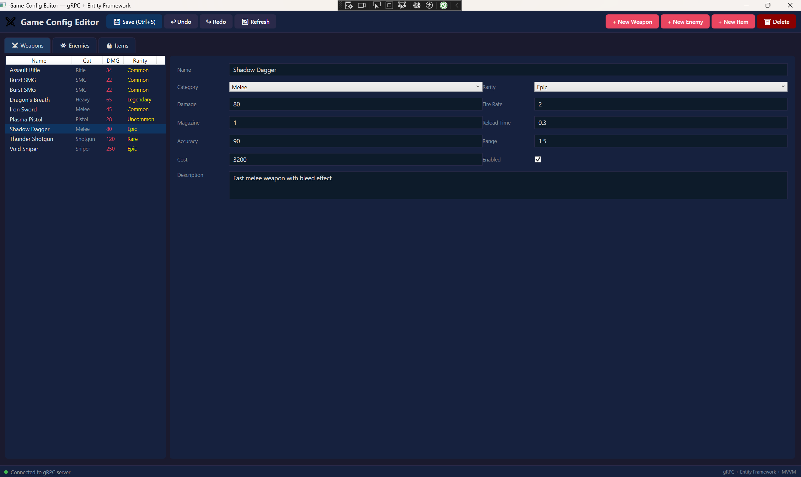
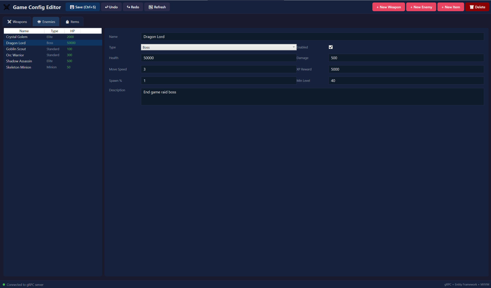
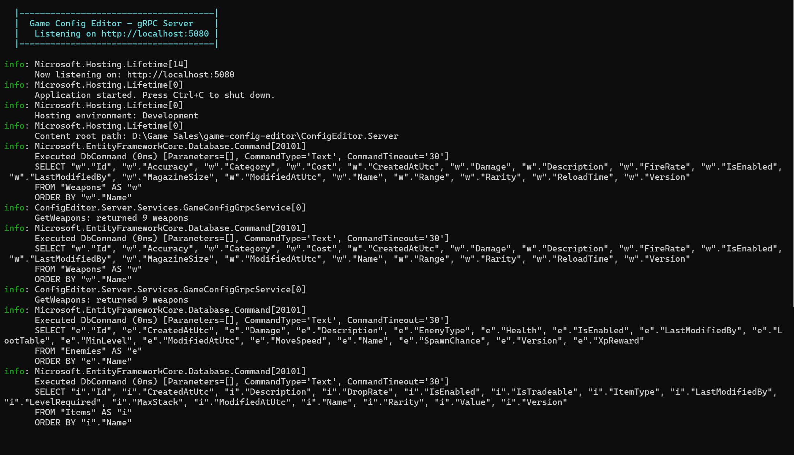

# GAME CONFIG EDITOR
This is a passion project and a portfolio piece where I am building a WPF game configuration editor with gRPC backend, Entity Framework, undo/redo system and data validation built for game studio tools workflow. Built using the foundational knowledge, working/creating and editing game configuration data from my own experience in AAA game studios like Ubisoft and NetEase Games. For this portrayal I have selected the elements such as weapons, enemies and loot items. Hopefully this is helpful to someoene in order to understand the exact tooling that game studio tools team build and maintain.



## PROJECT OVERVIEW

Every game studio needs internal tools for designers to tweak game data such as weapon damage values, enemy spawn rates, item drop tables etc. These editors must be fast, reliable and designer friendly. This project implements a full stack game configuration editor with:

- **WPF Frontend** - tabbed editor with MVVM architecture for weapons, enemies and items
- **gRPC Backend** - high performance RPC server handling all CRUD operations
- **Entity Framework Core** - ORM with SQLite for data persistence and versioning
- **Undo/Redo System** - command pattern implementation for reversible edits
- **Data Validation** - attribute based validation on all configuration models
- **Shared Protocol** - protobuf defined contract between client and server

## ARCHITECTURE

```
----------------------------------------------------
|           WPF EDITOR (ConfigEditor.App)          |
|                                                  |
|  |--------------|  |----------|  --------------  |
|  |  MVVM Views  |  | Commands |  | Undo/Redo  |  |
|  |  (XAML)      |  | (Relay)  |  | (Command   |  |
|  | TabControl   |  |          |  |  Pattern)  |  |
|  |--------------|  |----------|  |------------|  |
|         |--------------|               |         |
|                 |                      |         |
|           |-----------|                |         |
|           | ViewModel |<---------------|         |
|           |-----------|                          |
|                 | GrpcConfigClient               |
----------------------------------------------------
                  | gRPC (Protocol Buffers)
|--------------------------------------------------|
|           |-----------|                          |
|           |  gRPC     |  ConfigEditor.Server     |
|           |  Service  |                          |
|           |-----------|                          |
|                 | Entity Framework Core          |
|           |-----------|                          |
|           |  SQLite   |                          |
|           |  Database |                          |
|           |-----------|                          |
|--------------------------------------------------|

|--------------------------------------------------|
|         ConfigEditor.Shared                      |
|  - Data Models (WeaponConfig, EnemyConfig, etc.) |
|  - DbContext + Seed Data                         |
|  - Protobuf Service Definition (.proto)          |
|--------------------------------------------------|
```



## FEATURES

### WPF Config Editor
- **Tabbed interface** for Weapons, Enemies and Items with list + editor panel layout
- **MVVM architecture** with full data binding - zero code behind logic
- **Undo/Redo** with Ctrl+Z / Ctrl+Y / Ctrl+Shift+Z keyboard shortcuts
- **Create, edit, delete** any configuration entry with immediate server sync
- **Dropdown selectors** for categories, rarities and enemy types
- **Data validation** preventing invalid entries from being saved
- **Dark theme** designed for extended use in a studio environment
- **Connection status** indicator with auto detection of server availability

### gRPC Server
- **Full CRUD operations** for weapons, enemies and items via gRPC
- **Protobuf defined contract** ensuring type safe communication
- **Entity Framework Core** with SQLite for data persistence
- **Automatic versioning** - each edit increments the record version
- **Seed data** - pre-populated with sample game configuration for immediate demo
- **Mapped entity-to-protobuf conversion** between database models and gRPC messages

### Undo/Redo System
- **Command pattern** implementation - each action is recorded as an undoable operation
- Supports **undo stack** and **redo stack** with proper invalidation
- **Tooltips** show what will be undone/redone
- Clean separation - the undo system is a standalone service, reusable across any editor

### Data Models
- **WeaponConfig** - damage, fire rate, magazine, accuracy, range, cost, rarity
- **EnemyConfig** - health, damage, move speed, XP reward, spawn chance, loot table
- **ItemConfig** - value, drop rate, max stack, level required, tradeable flag
- All models include **version tracking**, **timestamps** and **validation attributes**

## TOOLS AND TECHNOLOGIES

- **C# / .NET 8.0** - application framework
- **WPF / XAML** - desktop UI with MVVM pattern
- **gRPC** - high-performance RPC framework
- **Protocol Buffers** - serialization and service contract definition
- **Entity Framework Core** - ORM for database access
- **SQLite** - embedded database
- **Command Pattern** - undo/redo implementation
- **Multi-project solution** - App, Server and Shared library

## PROJECT STRUCTURE

```
game-config-editor/
|-- ConfigEditor.Shared/              # Shared library
|   |-- Models/
|   |   |-- GameConfig.cs             # WeaponConfig, EnemyConfig, ItemConfig
|   |-- Data/
|   |   |-- ConfigDbContext.cs        # EF Core context + seed data
|   |-- Protos/
|       |-- config_service.proto      # gRPC service definition
|-- ConfigEditor.Server/              # gRPC backend
|   |-- Services/
|   |   |-- GameConfigGrpcService.cs  # gRPC service implementation
|   |-- Program.cs                    # Server startup
|-- ConfigEditor.App/                 # WPF editor
|   |-- ViewModels/
|   |   |-- EditorViewModel.cs        # Main editor logic
|   |-- Commands/
|   |   |-- RelayCommand.cs           # MVVM command implementation
|   |-- Services/
|   |   |-- GrpcConfigClient.cs       # gRPC client wrapper
|   |   |-- UndoRedoService.cs        # Undo/redo command pattern
|   |-- Converters/
|   |   |-- SafeNumberConverter.cs    # String to number binding converters
|   |-- MainWindow.xaml               # Editor UI
|   |-- MainWindow.xaml.cs            # Minimal code behind
|-- images/                           # Screenshots
```

## GETTING STARTED

### Prerequisites
- Windows 10/11
- .NET 8.0 SDK
- Visual Studio 2022

### Build & Run
```bash
git clone https://github.com/rush2pranav/game-config-editor.git
# Open GameConfigEditor.sln in Visual Studio
# Build -> Build Solution
```

1. Set **ConfigEditor.Server** as startup project -> Press F5
2. Verify server shows "Listening on http://localhost:5080"
3. Keep server running -> Right-click **ConfigEditor.App** -> Debug -> Start New Instance
4. The editor will connect via gRPC and load all configuration data

### Keyboard Shortcuts
| Shortcut | Action |
|----------|--------|
| Ctrl+S | Save current entry |
| Ctrl+Z | Undo last action |
| Ctrl+Y | Redo |
| Ctrl+Shift+Z | Redo (alternative) |



## gRPC SERVICE DEFINITION

```protobuf
service ConfigService {
  rpc GetWeapons (GetAllRequest) returns (WeaponListReply);
  rpc SaveWeapon (WeaponReply) returns (SaveReply);
  rpc DeleteWeapon (GetByIdRequest) returns (SaveReply);
  // + Enemy and Item operations
}
```

The protobuf contract in `config_service.proto` is compiled into C# classes at build time and shared between client and server, ensuring type safe communication with zero manual serialization code.

## WHAT I LEARNED

- **gRPC is significantly faster than REST for internal tools** - Binary serialization via Protocol Buffers and HTTP/2 multiplexing make gRPC ideal for the rapid request response patterns that editor tools need. The protobuf contract also catches breaking changes at compile time rather than runtime.
- **Entity Framework Core simplifies database work dramatically** - Code first models with automatic migrations, LINQ queries and change tracking meant I could focus on the application logic rather than writing SQL. The SQLite provider made development frictionless with zero database server configuration.
- **The Command Pattern makes undo/redo elegant** - Each undoable action captures both its "do" and "undo" logic and the stack based approach naturally handles complex undo chains. This pattern is used in virtually every professional editor tool.
- **Shared libraries prevent drift between client and server** - Having models, the database context and the protobuf definition in a shared project means both sides always agree on the data contract. Any model change is immediately reflected everywhere.
- **Value converters solve real WPF binding problems** - The SafeNumberConverter pattern gracefully handles empty strings in numeric TextBoxes and is something every WPF developer encounters and needs to solve cleanly.

## POTENTIAL EXTENSIONS

- Add data versioning history (view and restore previous versions of any config)
- Implement real time collaborative editing with gRPC streaming
- Add import/export to JSON/CSV for designer workflows
- Build a diff view for comparing config versions side by side
- Add role based permissions (read only for some users, edit for others)
- Implement search and filtering across all config types
- Add a visual graph editor for enemy spawn wave configurations
- Deploy the server as a Docker container for team wide access

## LICENCE

This project is licenced under the MIT Licence - see the [LICENCE](LICENCE) file for details.

---

*Built as part of a Game Tools Programmer portfolio. This capstone project demonstrates WPF/XAML/MVVM, gRPC, Entity Framework Core and system design skills directly relevant to internal tools development at AAA game studios. I am open to any and every feedback, please feel free to open an issue or connect with me on [LinkedIn](https://linkedin.com/in/phulpagarpranav/).*


